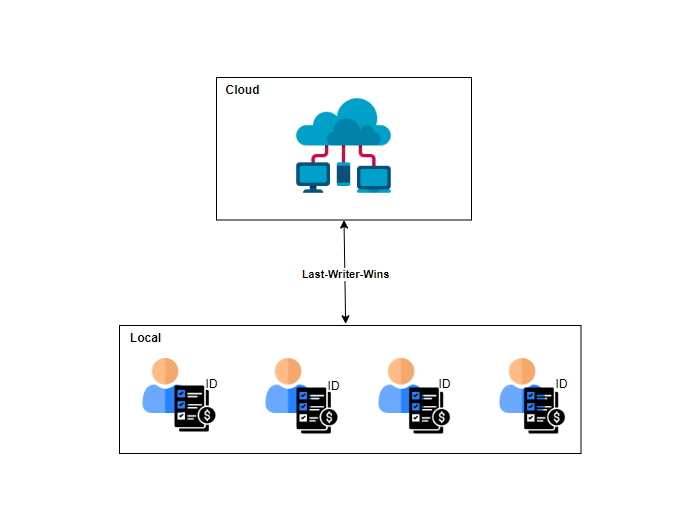
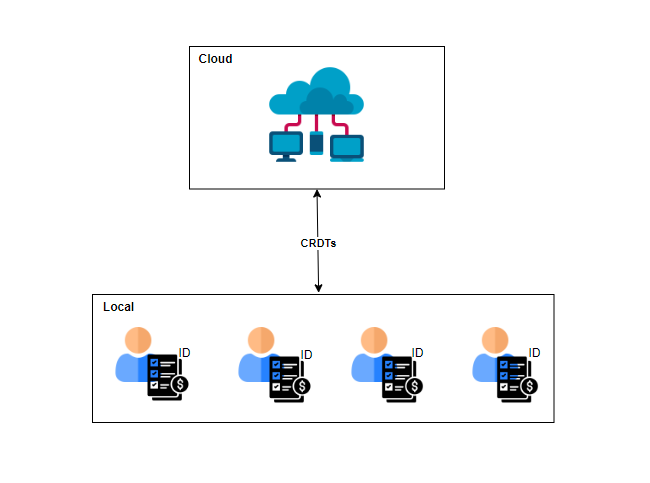

# Architecture

## Link diagram: https://drive.google.com/file/d/1cf-vog9h5PJKpN2sgYrQ8YcekiizRRbt/view (ask permission)

## Link docs: https://docs.google.com/document/d/1z-NKCCy1gVm1qApClmNClSmaLHOZ2kwVCsl1ABZy0FM/edit?usp=sharing

A key element of the project is the architecture of the local-first shopping list application, which establishes the general system architecture and the ways in which the local and cloud components interact to offer a seamless user experience.

Local Components:

The application's local components, which are installed on user's devices, are essential to its capacity to provide high availability, store data locally, and promote user collaboration. Among these elements are:

* User Interface (UI): The UI allows users to create, view, and amend shopping lists. It is the layer that they can see. Users can maintain their lists, add items, and mark tasks as done through the user interface.

* Local Database: User's devices can keep shopping lists and the things on them in a local database. Users can now access and edit their lists while they're not connected.

* Concurrency management is required to manage possible simultaneous updates of shopping lists by many users. To find the order of actions and settle disputes, the application first uses local clocks and the "Last-Writer-Wins" technique.

Cloud Components:

The cloud's component parts are essential to availability, scalability, and data synchronization among user's devices. These elements consist of:

* Cloud Storage: Users can keep shared shopping lists on a cloud storage platform. With the help of the cloud component, users can access and collaborate on lists since each list is uniquely recognized by an ID, such as a URL.

* Data Replication: Data replication is essential to maintaining shopping list's accessibility and consistency across several platforms. Currently, the program uses "Last-Writer-Wins" to resolve conflicts; however, in the future, Conflict-Free Replicated Data Types (CRDTs) will be implemented to improve conflict resolution.

* Data Sharding: A data sharding approach is used to distribute shopping lists over several servers because each shopping list is independent, and the service is intended to serve millions of customers. This promotes scalability and reduces bottlenecks in data access.

The architecture of the program is built to support a wide user base, provide high data availability, and facilitate effective user collaboration. Additionally, the design provides the development team with flexibility in selecting the programming languages, frameworks, and technologies that are used to construct the various components, enabling them to make decisions that are optimal for the demands of the project. The structure of the application plays a critical role in guaranteeing that users may reliably and efficiently access the functionalities of the local-first shopping list.

